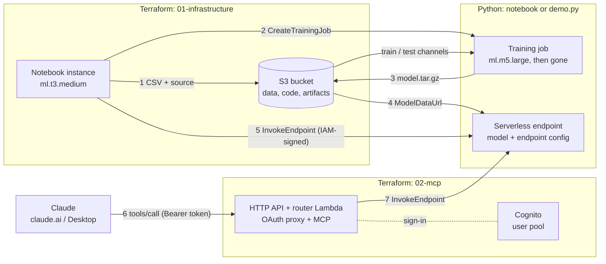

# Random Forest on SageMaker: Train Once, Predict Without Retraining

This project is an end-to-end demonstration of **conventional machine learning
on Amazon SageMaker AI**: a scikit-learn random forest trained in a managed
training job, saved as `model.joblib`, and served from an on-demand
**Serverless Inference** endpoint.

It uses **Terraform** for the static infrastructure and **plain boto3** (no
SageMaker Python SDK) for everything SageMaker runs, so every API request is
visible. A Jupyter notebook walks through it step by step, and a CLI
(`demo.py`) does the same steps from a terminal.

The point it makes: **training compute disappears when training finishes.**
What survives is one ~1 MB file in S3. A separate process in a separate
container loads that file and keeps answering, with no training data and no
retraining.

No LLM, Bedrock or external inference API is involved. The 200 decision trees
make every prediction themselves.

> **Synthetic data.** The equipment readings and failure labels are generated
> from a made-up formula with deliberate noise. This is a demonstration of the
> workflow, not a validated equipment failure model.

Key capabilities demonstrated:

1. **Managed training in script mode.** The AWS scikit-learn container runs
   `ml/train.py` on an `ml.m5.large`, uploads `/opt/ml/model` as
   `model.tar.gz`, and shuts down. You never build an image.
2. **An honest evaluation.** A stratified split happens before upload. The
   held-out rows travel as their own channel, are used once after fitting,
   and are never used for tuning. Accuracy, precision, recall and the
   confusion matrix are recorded on the training job itself.
3. **The artifact, opened up.** The notebook downloads `model.tar.gz`, lists
   it, loads the forest, and draws the top of one tree.
4. **Serverless Inference.** The same image serves the same artifact, with no
   provisioned concurrency, so nothing runs between requests.
5. **Strict request handling.** Named JSON fields are mapped onto the
   training column order. Missing, unknown, non-numeric and non-finite
   values are rejected with HTTP 400 and a reason.
6. **The model as a Claude tool.** A remote MCP connector, signed in through
   Cognito, lets claude.ai or Claude Desktop call the model as
   `predict_equipment_failure`. Claude sees the tool, not the model or any
   AWS credential.
7. **Clean, repeatable runs.** Reruns reuse rather than duplicate. Every
   Python-created name is recorded before it is created, and one teardown
   removes both the Python-created and the Terraform-owned resources.

## Architecture



### Who owns what

| Owner | Resources | Created by | Removed by |
|---|---|---|---|
| **Terraform** | S3 bucket (public access blocked, SSE-S3, TLS-only), notebook role, execution role, notebook instance + lifecycle script, project files under `notebook-source/` | `./apply.sh` | `terraform destroy` (inside `./destroy.sh`) |
| **Terraform** (`02-mcp`) | Cognito user pool + Hosted UI + client, OAuth-state DynamoDB table, HTTP API, router Lambda and its role | `./apply.sh` | `terraform destroy` (inside `./destroy.sh`, first) |
| **Python** | training jobs, models, endpoint configs, the endpoint, their CloudWatch logs, S3 `data/`, `code/`, `training-output/`, `state/` | the notebook or `demo.py` | `demo.py cleanup` (inside `./destroy.sh`) |

The two IAM roles are separate on purpose. The **notebook role** may start
jobs, deploy, invoke and clean up, but only resources whose names start with
the prefix, and it may pass exactly one role to SageMaker. The **execution
role** is what the training and inference containers run as. It can read the
inputs and write artifacts under `training-output/`, and nothing else.

There is no VPC and no NAT gateway. The notebook has direct internet access
(to pip-install its kernel), and SageMaker runs training and inference in
service-managed networks.

### Resource names

Everything is named `<prefix>-...` (default `sagemaker-pp`), which is how
both IAM and cleanup scope themselves:

| Resource | Name |
|---|---|
| Training job | `<prefix>-train-<UTC yyyymmdd-hhmmss>` |
| Model | `<prefix>-model-<same timestamp>` |
| Endpoint config | `<prefix>-epc-<same timestamp>` |
| Endpoint | `<prefix>-endpoint` (one, reused across runs) |

## Prerequisites

* [An AWS Account](https://aws.amazon.com/console/) with SageMaker AI available in your Region
* [Install AWS CLI](https://docs.aws.amazon.com/cli/latest/userguide/getting-started-install.html), authenticated
* [Install Terraform](https://developer.hashicorp.com/terraform/install) 1.9 or newer
* [Install jq](https://jqlang.github.io/jq/download/), `curl` and `openssl`
* Python 3 (for `destroy.sh`'s cleanup step). The optional local CLI
  (`demo.py`) needs **Python 3.10, 3.11 or 3.12**, because scikit-learn
  1.4.2 has no wheels for 3.13+.

If this is your first time following along, we recommend starting with this
video:
**[AWS + Terraform: Easy Setup](https://www.youtube.com/watch?v=9clW3VQLyxA)**.
It walks through configuring your AWS credentials, Terraform backend and CLI
environment.

## Download this Repository

```bash
git clone https://github.com/mamonaco1973/aws-sagemaker-pp.git
cd aws-sagemaker-pp
```

## Configure (optional)

The defaults deploy to **us-east-1** with prefix **sagemaker-pp**. To change
the Region, prefix, instance types or serverless settings:

```bash
cp 01-infrastructure/terraform.tfvars.example 01-infrastructure/terraform.tfvars
# edit, then deploy as below
```

## Deploy

```bash
./apply.sh
```

`apply.sh` runs `check_env.sh`, then `terraform apply` in `01-infrastructure`
(**about 5 to 7 minutes**, mostly the notebook reaching InService). It writes
`demo-config.json` for the CLI, applies `02-mcp` (the connector, about a
minute), and runs `validate.sh`. That script confirms the notebook is
InService, exercises the MCP connector with a throwaway Cognito user, and
prints the JupyterLab link and the connector URL.

`apply.sh` creates **no training job and no endpoint**. Nothing is billed
per request until you run the notebook or the CLI.

## Use the Model from Claude (MCP)

`02-mcp` deploys a remote MCP server: an HTTP API in front of one Lambda that
serves the OAuth endpoints and the MCP JSON-RPC endpoint. It exposes one tool:

| Tool | Arguments | Returns |
|---|---|---|
| `predict_equipment_failure` | `readings`: 1 to 100 `{temperature, vibration, operating_hours}` | one line per reading: label and failure probability |

On `tools/call` the Lambda calls `InvokeEndpoint` on `<prefix>-endpoint`
with its own role, whose only SageMaker permission is that one call on that
one endpoint. Claude sees the tool's description, its arguments and the text
that comes back: never the model, the endpoint or an AWS credential.

**Connect it:**

1. Deploy the model first (`python demo.py deploy`, or notebook section 9).
   Without it the tool answers "not deployed" with the command to fix that.
2. Sign-up is **open**: on first connect, choose **Sign up** on the Cognito
   page and verify your email. Anyone who finds the URL can do the same;
   that is acceptable for a synthetic demo model. To skip email, or to lock
   it down, create users yourself (and set `allow_admin_create_user_only =
   true` in `02-mcp/cognito.tf`):
   ```bash
   ./add_mcp_user.sh you@example.com      # prints a generated password
   ```
3. In claude.ai: **Settings → Connectors → Add custom connector**, and paste
   the connector URL `validate.sh` printed
   (`https://<api-id>.execute-api.<region>.amazonaws.com/mcp`).
4. Click **Connect** and sign up or sign in on the Cognito page.
5. Ask, for example: *"Machine A reads 81 °C, 5.1 mm/s and 11,000 hours;
   machine B 63 °C, 1.4 mm/s and 900 hours. Which needs maintenance?"*

The OAuth layer (`02-mcp/code/oauth.py`, `router.py`) comes unchanged from
[aws-cognito-mcp](https://github.com/mamonaco1973/aws-cognito-mcp). It
advertises itself as the authorization server and supports dynamic client
registration, which Cognito alone does not. It also brokers claude.ai's
per-organisation `redirect_uri`, which Cognito's exact-match allow-list
rejects.

Bad readings come back to Claude as a tool error with the endpoint's own
message (for example "reading is missing operating_hours"), so it can fix
the call. A cold endpoint's first 502 is retried inside the Lambda, within
API Gateway's 30-second limit.

## Walkthrough (notebook)

1. Open the link `validate.sh` printed, or in the console go to SageMaker AI,
   then **Notebook instances**, then **Open JupyterLab**.
2. Open `aws-sagemaker-pp/notebook/sagemaker_random_forest.ipynb`.
3. Choose the kernel **Python 3 (sagemaker-demo)**. On the very first start
   the lifecycle script builds it in the background (**about 3 minutes**); see
   `aws-sagemaker-pp/kernel-setup.log`. The first cell checks the versions.
4. Run the cells top to bottom:

| § | Section | Waits |
|---|---|---|
| 1 | Architecture and terminology; config and credentials | |
| 2 | Generate and inspect the dataset | |
| 3 | Upload the data and the training code | |
| 4 | Launch the training job and wait | **3 to 5 min** |
| 5 | Evaluation results (from the training job's record) | |
| 6 | Locate and download the model artifact | |
| 7 | Inspect the archive and the trained model | |
| 8 | Look inside one tree (top three levels of splits) | |
| 9 | Deploy to Serverless Inference | **3 to 6 min** |
| 10 | Send new readings; batch request; bad requests | first call: cold start |
| 11 | Clean up the endpoint, configs and models | **1 to 2 min** |

The notebook needs no credentials or ARNs. It reads `demo-config.json`, which
the lifecycle script wrote from the Terraform outputs, and calls AWS as the
notebook's IAM role through the default credential chain.

## Walkthrough (CLI)

The same steps from your own terminal, using your AWS CLI credentials:

```bash
python3.12 -m venv .venv            # 3.10 or 3.11 also work
source .venv/bin/activate
pip install -r requirements.txt

python demo.py train                # generate, upload, train, wait  (~3-5 min)
python demo.py evaluate             # accuracy, precision, recall, confusion matrix
python demo.py artifact             # download model.tar.gz, list it, print a tree
python demo.py deploy               # serverless endpoint             (~3-6 min)
python demo.py predict              # the three sample readings
python demo.py predict --json '{"temperature": 82, "vibration": 4.6, "operating_hours": 9800}'
python demo.py status               # what exists right now
python demo.py cleanup              # delete endpoint, configs, models; keep S3 data
python demo.py notebook-stop        # stop paying for the notebook
```

Every command is safe to repeat. `train` waits on a job that is already
running instead of starting a second one. `deploy` leaves an endpoint that
already serves the latest model alone, and switches one serving an older
model in place.

Raw AWS CLI equivalents, for reference:

```bash
EP=sagemaker-pp-endpoint
aws sagemaker list-training-jobs --name-contains sagemaker-pp-train --sort-by CreationTime
aws sagemaker describe-endpoint --endpoint-name $EP --query EndpointStatus
aws sagemaker-runtime invoke-endpoint --endpoint-name $EP \
  --content-type application/json --cli-binary-format raw-in-base64-out \
  --body '{"temperature": 82, "vibration": 4.6, "operating_hours": 9800}' /dev/stdout
```

## The Dataset and Model

* **Features:** `temperature` (°C, mean 70), `vibration` (mm/s, log-normal,
  median 2.8), `operating_hours` (0 to 12,000).
* **Label:** `healthy` or `failure`, drawn per machine from a probability that
  rises with heat, vibration, age and heat × vibration. The model sees noisy
  sensor measurements, not the true values. About 29% of machines fail, and
  a large share sit in the uncertain middle where the coin flip decides.
* **Deterministic:** seed 42, numpy pinned, so every run produces the same
  5,000 rows and the same 80/20 stratified split.
* **Model:** `RandomForestClassifier(n_estimators=200, max_depth=8,
  min_samples_leaf=10, random_state=42)`. Depth and leaf size bound the
  forest; with `joblib.dump(compress=3)` the artifact is about 1 MB.
* **Held-out results** (local run, same code and versions): accuracy 0.854,
  precision 0.808, recall 0.645. Confusion matrix (rows actual): healthy 669
  / 44, failure 102 / 185. Better than always guessing healthy (0.713), and
  not perfect, as noisy labels require. A live run should give the same
  numbers, since the data and seeds are fixed.

### What is in the artifact

| File in `model.tar.gz` | Purpose |
|---|---|
| `model.joblib` | The fitted forest: 200 trees of split features, thresholds and leaf class counts, plus fitted attributes (`classes_`, `feature_names_in_`, ...). |
| `metadata.json` | Feature order, class labels, hyperparameters, feature importances, and the Python, scikit-learn, numpy and joblib versions it was trained with. |
| `evaluation.json` | Held-out metrics and confusion matrix. |
| `samples.json` | Three new readings (never seen in training) the model scored lowest-risk, closest to 50/50, and highest-risk, with the probability it gave each. |
| `code/inference.py` | The serving code. The archive is self-contained. |

`model.joblib` is a **pickle of scikit-learn objects**. It is not a portable
model format, and it needs a compatible Python and the same scikit-learn to
load. So the endpoint uses the same image that trained it, and the notebook
kernel pins the container's versions. Only load pickles you trust.

## Inference

* **Image:** `683313688378.dkr.ecr.us-east-1.amazonaws.com/sagemaker-scikit-learn:1.4-2-py312-cpu-py3`
  (scikit-learn 1.4.2, numpy 2.1.0, pandas 2.3.2, Python 3.12). It is used
  for **both** training and serving. The per-Region registry account is in
  `01-infrastructure/locals.tf`.
* **Inside the endpoint container:** SageMaker extracts `model.tar.gz` into
  **`/opt/ml/model/`**. The model's `SAGEMAKER_SUBMIT_DIRECTORY` is
  `/opt/ml/model/code` (also on `PYTHONPATH`), so the container loads `inference.py` from the
  archive, then calls **`model_fn("/opt/ml/model")`**. That runs the one
  **`joblib.load("/opt/ml/model/model.joblib")`**, once per serving process,
  and logs it to `/aws/sagemaker/Endpoints/<prefix>-endpoint`.
* **Requests:** `application/json`, one reading or `{"instances": [...]}`
  (up to 100). Fields are matched by name, so their order does not matter.
* **Responses:** `{"predictions": [{"label": "failure", "failure_probability": 0.952}], "feature_order": [...]}`.
* **Errors:** HTTP 400 with `{"error": "reading is missing operating_hours"}`
  and similar. Through boto3 this surfaces as `ModelError`, and `demo.py`
  prints the reason.
* **Security:** there is no public URL. `InvokeEndpoint` is a SigV4-signed AWS
  API call, allowed by `sagemaker:InvokeEndpoint` on the endpoint's ARN.
* **Cold starts:** a serverless endpoint with no recent traffic has no
  container running. The first request waits while SageMaker starts one and
  `model_fn` loads the forest; requests after that are fast.
* **Serverless settings:** 2048 MB, `MaxConcurrency` 1, and no
  `ProvisionedConcurrency`, so it scales to zero. A second concurrent request
  is throttled, not queued: raise `serverless_max_concurrency` for parallel
  callers.

## Cost

Prices from the AWS Price List API for **us-east-1**, retrieved 2026-10-06.
Other Regions differ.

| Item | Rate | A typical demo |
|---|---|---|
| Notebook `ml.t3.medium` | $0.05/hour while InService | 1-2 hours: **$0.05-0.10** |
| Notebook storage (10 GB) | $0.14/GB-month | under $0.01 |
| MCP connector (API Gateway, Lambda, DynamoDB, Cognito) | per request; Cognito free tier covers 10,000 monthly active users | effectively $0 |
| Training `ml.m5.large` | $0.115/hour, per second | a few minutes: **about $0.01** per run; capped at 15 min (**$0.03**) by `MaxRuntimeInSeconds` |
| Serverless Inference, 2 GB | $0.00004/second of processing | tens of requests: **under $0.01** |
| Serverless data processed | $0.016/GB | negligible (bytes per request) |
| S3, CloudWatch Logs | standard | fractions of a cent |

**Expected total for a 1 to 2 hour demonstration: well under $1.** That is
an estimate, not a cap. What can run up a bill is **leaving the notebook
running** (about $1.20/day, $36/month); stop it or destroy the stack. An idle
serverless endpoint costs nothing for compute. On eligible accounts the
SageMaker free tier (first two months) covers `ml.t3.medium` notebook hours
and serverless inference seconds. Its training hours are for `m4.xlarge` and
`m5.xlarge` only, not the `ml.m5.large` used here.

## Troubleshooting

| Symptom | Cause and fix |
|---|---|
| `terraform apply`: *No SageMaker scikit-learn image registry is known for this Region* | Use a Region listed in `01-infrastructure/locals.tf`. |
| Notebook **Failed** to start | The lifecycle script failed. Read CloudWatch `/aws/sagemaker/NotebookInstances`, stream `<prefix>-notebook/LifecycleConfigOnStart`. |
| Kernel **Python 3 (sagemaker-demo)** is missing | The first start builds it in the background. Wait for `KERNEL READY` in `aws-sagemaker-pp/kernel-setup.log`, then refresh the kernel list. If the log shows an error, stop and start the notebook to retry. |
| First cell: *Wrong kernel* | Switch the kernel to **Python 3 (sagemaker-demo)**. |
| `ResourceLimitExceeded` on training or deploy | Your account's quota for `ml.m5.large for training job usage`, or for serverless concurrency, is 0 or used up. Request an increase in Service Quotas, or set `training_instance_type` in `terraform.tfvars`. |
| Training job **Failed** | `demo.py` prints `FailureReason`. Full logs: CloudWatch `/aws/sagemaker/TrainingJobs`, stream `<job name>/algo-1-...`. |
| Training still running after 30 minutes of waiting | The job continues (capped by `MaxRuntimeInSeconds`). Reattach with `python demo.py wait`. |
| Endpoint **Failed** | `FailureReason` is printed. Logs: `/aws/sagemaker/Endpoints/<prefix>-endpoint`. Then `python demo.py cleanup` and deploy again. |
| `HTTP 400 from the model: ...` | The request failed validation; the message names the field. |
| `ThrottlingException` | More concurrent requests than `serverless_max_concurrency`. Send them sequentially, or raise the setting. |
| First prediction is slow, or logs `HTTP 502 while the endpoint starts` | A cold start: the container's nginx can answer before its Python server is up. `invoke()` retries 502/503/504 up to 6 times, 5 s apart. |
| `AccessDenied` from the notebook | IAM is scoped to names starting with the prefix. Use the provided helpers, not hand-picked names. |
| `destroy.sh` stops on **BucketNotEmpty** | The bucket holds objects this demo did not write (cleanup lists them). Move or delete them, then rerun `./destroy.sh`. |
| `pip install -r requirements.txt` fails locally | Use Python 3.10 to 3.12. |
| Claude's tool says the endpoint is not deployed | Run `python demo.py deploy` (or notebook section 9), then ask again. |
| Connector returns 401 | The token expired (24 h) or the user was deleted. Reconnect the connector in Claude's settings. |

## Teardown

```bash
./destroy.sh
```

One script, two owners, in this order:

1. **`terraform destroy` in `02-mcp`** removes the connector first, so
   nothing can call the model during teardown.
2. **`demo.py cleanup --purge-data`** stops any running training job, deletes
   the endpoint (and waits until it is gone), the endpoint configs, the
   models, and their CloudWatch logs, then deletes the demo's own S3
   prefixes (`data/`, `code/`, `training-output/`, `state/`). It finds
   resources from `s3://<bucket>/state/resources.json`, which is written
   *before* each create call, **and** by name prefix, so it also works after
   a crash or a partial deploy. If this step fails, Terraform is not run.
3. **`terraform destroy` in `01-infrastructure`** stops and deletes the notebook instance, deletes
   both roles, the lifecycle configuration, Terraform's own S3 objects, and
   the bucket.

The bucket is never force-emptied. If it contains anything the demo did not
write, cleanup names it, `terraform destroy` stops on the bucket (after
deleting everything else), and you decide what to do with it.

Training job **records** cannot be deleted in SageMaker. They stay listed in
the console and cost nothing.

**To pause instead of destroying:** stop the notebook (console **Stop**, or
`python demo.py notebook-stop`). Files under `/home/ec2-user/SageMaker` are
kept, and **Start** brings it back with the kernel already built.

## What Has and Has Not Been Verified

Verified locally without AWS (`./tests/run_local_checks.sh`, which needs
Docker and Terraform):

* Terraform `fmt` and `validate`. The lifecycle script is rendered by
  Terraform and passes `bash -n`.
* Dataset determinism, the stratified split, and probabilistic (not
  separable) labels.
* Training, evaluation, the artifact layout, and the artifact size. Flipping
  every held-out label leaves the fitted trees bit-for-bit identical, so the
  test rows do not influence the fit.
* Reloading `model.joblib` in a fresh interpreter, and in a **Python 3.10**
  image built from `requirements.txt` (the notebook kernel). It reproduces the
  Python 3.12 run's probabilities.
* `train.py` run by the scikit-learn container's own training entry point
  (`sagemaker-training` 4.8.0), using the exact hyperparameters
  `CreateTrainingJob` sends.
* `inference.py` served by the container's own serving code
  (`sagemaker-sklearn-container` v1.4-2-py312 and its pinned Flask and
  `sagemaker-containers`), **with networking disabled**, as a non-root user,
  and with an externally-managed (PEP 668) Python, like the real endpoint.
  Valid requests, batches, and 400s for bad input all pass.
* Input validation: missing and unknown fields, strings, booleans, null, NaN,
  Infinity, overflow, wrong content type, too many readings. Mapping by
  name: reordered fields give the same answer; swapped values do not.
* Orchestration against in-memory fakes. Deploy is idempotent and switches
  models in place. Cleanup deletes in dependency order, ignores lookalike
  names, never deletes unrelated S3 objects, and finds resources with the
  state file deleted or with the name search blind.
* IAM name patterns in `iam.tf` match every name the code generates.
* Notebook: valid nbformat, eleven numbered sections, all code parses, it
  calls only functions that exist, and it is in sync with `make_notebook.py`.
  Its non-AWS cells execute in the kernel image.

**Verified live in us-east-1 (2026-10-06)**, with the CLI:

* `./apply.sh`: 23 resources; the notebook reached InService in 5m15s, and
  its lifecycle script ran.
* Training job: Completed, 94 billable seconds on `ml.m5.large`. Its metrics
  exactly match the local run (accuracy 0.854, precision 0.808, recall
  0.645).
* Serverless endpoint: InService. The three sample readings return the same
  probabilities as at training time; warm calls take 0.15-0.35 s. A bad
  request gets HTTP 400 with its reason, and batch requests work.
* `demo.py cleanup`: deleted the endpoint, config, model and logs in order,
  and kept the S3 data.

The live run found three problems the local stand-in could not, all now
fixed and reproduced locally. The real image's Python is the distribution's
(PEP 668), its server runs as a non-root user, and the first call after a
cold start can get a 502 from nginx (`invoke()` retries it).

**MCP connector, verified live the same day:** OAuth discovery, 401 without
a token, and `initialize`, `tools/list` and `tools/call` with a real Cognito
token. That token came from the admin sign-in API, not claude.ai's browser
flow.

**Still to verify:** connecting from claude.ai itself (the OAuth layer is the
one proven in aws-cognito-mcp), ChatGPT connectors, the notebook kernel build and a full notebook run,
`./destroy.sh` against real resources, the IAM policy when driven from the
notebook (the CLI run used the operator's credentials), and Regions other
than us-east-1.

## Local Verification

```bash
./tests/run_local_checks.sh    # Docker + Terraform; no AWS calls
```

## Layout

```
apply.sh / destroy.sh       Deploy both phases; tear down (connector, Python resources, infrastructure)
add_mcp_user.sh             Create a Cognito login without self sign-up
check_env.sh / validate.sh  Tooling and credentials; post-deploy check and quick start
demo.py                     CLI: train, evaluate, artifact, deploy, predict, status, cleanup
requirements.txt            Notebook kernel and CLI pins (Python 3.10-3.12)
make_notebook.py            Generates the notebook; edit cells here
RECORDING.md                5-8 minute video walkthrough with cut points
01-infrastructure/          Terraform: bucket, IAM, notebook, lifecycle script
  scripts/on-start.sh       Copies the project, writes demo-config.json, builds the kernel
ml/                         Runs inside SageMaker (and locally)
  dataset.py                Synthetic data, seeded
  train.py                  Training entry point (script mode)
  inference.py              model_fn / input_fn / predict_fn / output_fn
  requirements.txt          The container's versions (for local tests; not installed by SageMaker)
02-mcp/                     Terraform: Cognito, HTTP API, router Lambda (the MCP connector)
  code/                     router.py + oauth.py (from aws-cognito-mcp), mcp.py (the tool)
sagemaker_demo/             boto3 orchestration shared by the notebook and demo.py
  config.py                 demo-config.json or terraform output
  workflow.py               data, training, artifact, deploy, invoke
  cleanup.py                dependency-ordered teardown of Python-created resources
notebook/                   sagemaker_random_forest.ipynb
tests/                      pytest, container-stack smoke tests, run_local_checks.sh
```
